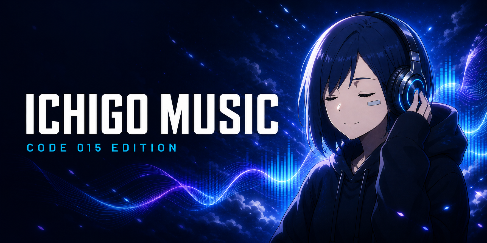

<div align="center">

  

  # 🍓 Ichigo Music (Code 015)

  **A High-Performance Desktop Music Player inspired by Apple Music & Darling in the Franxx**  
  *แอปพลิเคชันฟังเพลงระดับพรีเมียมบนเดสก์ท็อป ถอดรหัสผ่าน Lavalink v4 พร้อมดีไซน์ธีม Ichigo*

  [](https://tauri.app/)
  [](https://react.dev/)
  [](https://www.typescriptlang.org/)
  [](https://tailwindcss.com/)
  [](LICENSE)

  [English](#english) • [ภาษาไทย](#ภาษาไทย) • [Socials & Contact](#creator--community-ช่องทางการติดต่อ)

</div>

---

<a name="english"></a>
## 🌐 English

### ✨ Features
- 🚀 **Lavalink v4 Audio Engine**: High-fidelity audio decoding and streaming powered by custom Lavalink v4 node server.
- 🎵 **Apple Music Fullscreen Player**: Immersive full-screen playback with dynamic glowing background backdrop & classic white player card.
- 🎤 **Synced Karaoke Lyrics**: Real-time synchronized LRC lyrics with glowing cyan text and interactive time-jumping capability.
- 🪄 **Auto Mix & Autoplay**: Intelligent continuous queue generation styled after Apple Music recommendations.
- 💙 **Ichigo (Code 015) Theme**: Dark navy blue design palette inspired by Ichigo from *Darling in the Franxx*.
- 🔍 **Smart Search & History**: Instant auto-suggestions and personal listening history tracking.
- 📊 **Server Diagnostics & Console**: Live Lavalink server health monitor and built-in debug log console.

### 🛠️ Tech Stack
- **Desktop Framework**: [Tauri v2](https://tauri.app/) (Rust)
- **Frontend**: [React 19](https://react.dev/) + [TypeScript](https://www.typescriptlang.org/)
- **Build Tool**: [Vite 7](https://vitejs.dev/)
- **Styling**: [Tailwind CSS v4](https://tailwindcss.com/)
- **Icons**: [Lucide React](https://lucide.dev/)
- **Audio Server**: [Lavalink v4](https://lavalink.dev/)

### 🚀 Getting Started

#### Prerequisites
- [Node.js](https://nodejs.org/) (v18+ recommended)
- [Rust](https://www.rust-lang.org/) (for Tauri development)

#### Installation & Development
```bash
# Clone the repository
git clone https://github.com/KCCHDEV/Ichigo-Music.git

# Navigate into directory
cd "Ichigo Music"

# Install dependencies
npm install

# Run frontend in development mode
npm run dev

# Run desktop app via Tauri
npm run tauri dev
```

#### Build Production App
```bash
npm run tauri build
```

---

<a name="ภาษาไทย"></a>
## 🇹🇭 ภาษาไทย

### ✨ ฟีเจอร์เด่น (Key Features)
- 🚀 **ระบบเสียง Lavalink v4 Engine**: ถอดรหัสและเล่นไฟล์เสียงคุณภาพระดับ High-Fidelity ลื่นไหล ไม่มีสะดุด
- 🎵 **เครื่องเล่นเพลงแบบ Apple Music**: โหมดเต็มหน้าจอสุดพรีเมียม พร้อมฉายแสงเปลี่ยนสีตามปกเพลงแบบเรียลไทม์
- 🎤 **เนื้อเพลงคาราโอเกะซิงค์เรียลไทม์ (LRC)**: ตัวหนังสือเรืองแสงสีฟ้า กดเลือกท่อนเพลงเพื่อกระโดดข้ามเวลาได้ทันที
- 🪄 **Auto Mix & Autoplay**: ระบบสืบค้นและจัดคิวเพลงอัตโนมัติต่อเนื่องสไตล์ Apple Music
- 💙 **Ichigo (Code 015) Theme**: ดีไซน์สีกรมท่า-น้ำเงินเข้ม แสงไซแอน เอกลักษณ์เฉพาะจากอนิเมะ *Darling in the Franxx*
- 🔍 **ค้นหาชาญฉลาด & ประวัติการฟัง**: Auto-Suggestions พร้อมบันทึกประวัติการเล่นเพลงย้อนหลังเฉพาะบุคคล
- 📊 **ระบบตรวจเช็กเซิร์ฟเวอร์ & คอนโซล**: ติดตามสถานะ Lavalink Node แบบเรียลไทม์พร้อมระบบบันทึก Console Log

### 🛠️ เทคโนโลยีที่ใช้
- **เดสก์ท็อปเฟรมเวิร์ก**: [Tauri v2](https://tauri.app/) (Rust)
- **ส่วนติดต่อผู้ใช้ (UI)**: [React 19](https://react.dev/) + [TypeScript](https://www.typescriptlang.org/)
- **เครื่องมือการสร้าง (Build Tool)**: [Vite 7](https://vitejs.dev/)
- **ตกแต่งสไตล์**: [Tailwind CSS v4](https://tailwindcss.com/)
- **ไอคอน**: [Lucide React](https://lucide.dev/)
- **เซิร์ฟเวอร์สตรีมมิ่งเสียง**: [Lavalink v4](https://lavalink.dev/)

### 🚀 ขั้นตอนการติดตั้งและการใช้งาน

#### สิ่งที่ต้องเตรียมก่อนใช้งาน (Prerequisites)
- [Node.js](https://nodejs.org/) (เวอร์ชัน 18 ขึ้นไป)
- [Rust](https://www.rust-lang.org/) (สำหรับการพัฒนา Tauri)

#### การติดตั้งและรันในโหมดพัฒนา
```bash
# คลองคลังโค้ดมาจาก GitHub
git clone https://github.com/KCCHDEV/Ichigo-Music.git

# เข้าไปยังโฟลเดอร์โปรเจกต์
cd "Ichigo Music"

# ติดตั้ง Packages ที่จำเป็น
npm install

# รันในโหมด Web Development
npm run dev

# รันแอปพลิเคชัน Desktop ด้วย Tauri
npm run tauri dev
```

#### การสร้างไฟล์ติดตั้ง (Build Production)
```bash
npm run tauri build
```

---

<a name="creator--community-ช่องทางการติดต่อ"></a>
## 👨💻 Creator & Community (ช่องทางการติดต่อ)

| Platform | Details / Link |
|---|---|
| **Developer** | **Nay Golf** |
| 👤 **Facebook** | [Nay Golf Profile](https://www.facebook.com/phu.phid.hwang.tlxd.pi.kxlf/) |
| 🐙 **GitHub** | [@KCCHDEV](https://github.com/KCCHDEV) |
| 💬 **Discord** | [Join Discord Server](https://discord.gg/4ZFgZxcHGU) |
| 📦 **Project Repository** | [KCCHDEV/Ichigo-Music](https://github.com/KCCHDEV/Ichigo-Music) |

---

<div align="center">

Made with ❤️ by **Nay Golf (KCCHDEV)**  
*Code 015 - Ichigo Theme*

</div>
